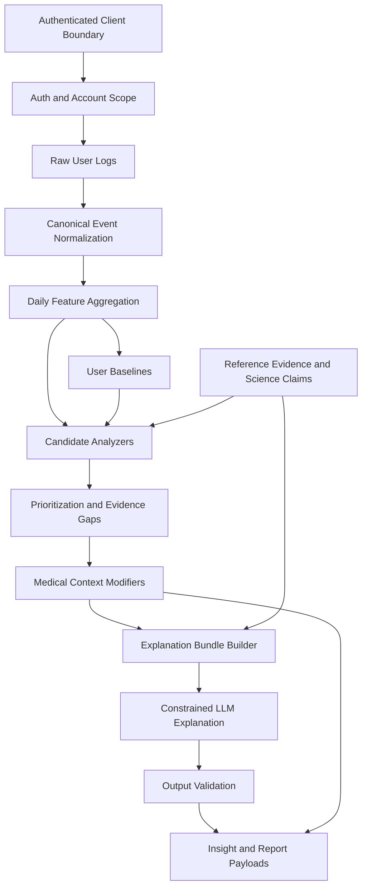

# GutWise Backend Architecture

## Document Status

First draft. This document describes the intended backend architecture for GutWise-MVP based on the current repository structure and the product vision for a science-informed gut-health intelligence platform.

This document is not a migration plan or implementation checklist. It defines the target backend shape that future implementation plans should follow.

## Purpose

GutWise is intended to transform personal gut-health and lifestyle logs into structured, evidence-aware, non-diagnostic pattern insights.

The architecture must support three responsibilities at the same time:

1. Preserve sensitive user data safely and privately.
2. Convert daily logs into testable, cumulative personal intelligence.
3. Connect personal patterns to reviewed scientific and clinical context without creating diagnostic or treatment claims.

The backend and intelligence architecture should make it possible to incorporate scientific literature and reference facts for every major logging domain: bowel movements, symptoms, food, hydration, sleep, stress, exercise, medications, menstrual cycle context, and medical context.

## Backend Scope

For this document, "backend" includes all persistence, data-access, normalization, intelligence, evidence, safety, and server-side generation responsibilities that support GutWise.

In the current codebase, some backend-adjacent logic runs in the TypeScript client because the app is a React and Supabase MVP. Those modules are still treated as backend architecture concerns when they:

- Fetch or assemble account-scoped data.
- Normalize raw logs into canonical event formats.
- Compute baselines, daily features, or insight candidates.
- Retrieve reference evidence or science claims.
- Prepare LLM explanation inputs.
- Validate generated health-related output.
- Invoke Supabase edge functions or storage.

The frontend may collect input and render outputs, but it should not own authoritative health intelligence rules.

## Architectural Principles

### 1. Deterministic Logic Before Generated Language

GutWise should identify and rank patterns through deterministic, testable logic before an LLM generates any user-facing explanation.

The LLM may explain a structured finding. It must not discover, invent, rank, or clinically interpret findings independently.

### 2. Evidence Before Insight

Every insight should be connected to one or both of these evidence streams:

- Personal evidence from user logs, baselines, support counts, contrast days, contradiction counts, and data sufficiency.
- Reference evidence from reviewed science claims, trusted data sources, medication references, nutrition references, or institutional guidance.

If evidence is limited, the product should say so clearly.

### 3. Domain Separation

Each logging domain should have a clear, bounded role in the system. Food intelligence should not be buried inside the insight ranking layer. Hydration science should not be hard-coded inside explanation prompts. Medication reference logic should not live inside UI components.

Domain-specific logic should be organized so each domain can answer:

- What raw data is collected?
- How is it normalized?
- What daily features are derived?
- What baselines are needed?
- What candidate patterns can be analyzed?
- What reference claims are relevant?
- What safety constraints apply?
- What explanation language is allowed?

### 4. Health Safety Is Architectural

Health safety should not depend only on UI copy or disclaimers. It must be enforced across:

- Database schema
- Service boundaries
- Candidate analyzers
- Evidence thresholds
- LLM input contracts
- Output validation
- Backend-produced report payloads
- Review tooling

GutWise must not produce diagnosis, treatment, medication, supplement, dosing, or disease-prevention claims.

### 5. Privacy by Default

GutWise data includes sensitive health-adjacent information. The architecture must treat bowel movements, symptoms, medications, medical context, uploaded documents, and account data as sensitive by default.

Do not log raw health entries, symptoms, lab values, document text, emails, tokens, or user identifiers unnecessarily.

## Current Backend Summary

GutWise-MVP currently uses Supabase Postgres, Supabase Auth, Supabase Storage, Supabase edge functions, and TypeScript service/intelligence modules as its backend foundation. The React client consumes these backend contracts and currently hosts some backend-adjacent TypeScript logic because this is an MVP codebase.

The current backend already contains several important components:

- Supabase authentication and account-scoped data access.
- Log tables and migrations for health and lifestyle tracking.
- Storage-backed medical document intake.
- Canonical event normalization in `src/lib/canonicalEvents.ts`.
- Daily feature aggregation in `src/lib/dailyFeatures.ts`.
- Baseline computation in `src/lib/baselines.ts`.
- Ranked insight candidate analyzers in `src/lib/insightCandidates/`.
- Ranked insight assembly in `src/services/rankedInsightsAssembler.ts`.
- Medical context services in `src/services/medicalContextService.ts`.
- Reference evidence tables and services in `src/services/referenceEvidenceService.ts`.
- Food and medication source ingestion edge functions.
- LLM explanation input contracts, serialization, invocation, persistence, and output validation.

The current backend architecture is directionally strong. The main backend challenge is to formalize the science-backed knowledge layer and connect it consistently to every logging domain.

## Target System Shape

GutWise should be organized as a layered intelligence system.



## Core Layers

### 1. Client Boundary and Backend Contract Layer

The client boundary is where authenticated frontend workflows interact with backend-owned contracts. This layer is included here only to define what the backend expects from clients and what clients should not own.

Current client consumers include logging pages, insights, reports, settings, medical context, document intake, and reference review screens.

Backend responsibilities at this boundary:

- Define the input payloads accepted from logging and settings flows.
- Validate user ownership before data access or mutation.
- Persist normalized, account-scoped records.
- Return safe, structured payloads for insights and reports.
- Keep analysis rules out of page components.
- Keep generated explanation text downstream of backend evidence contracts.

Client responsibilities at this boundary:

- Capture user input according to backend contracts.
- Render evidence, uncertainty, and gaps returned by backend services.
- Avoid inventing health claims or modifying backend-generated safety language.

### 2. Data Access and Service Layer

The service layer owns calls to Supabase, edge functions, storage, and cross-table assembly.

Current examples:

- `src/services/rankedInsightsAssembler.ts`
- `src/services/medicalContextService.ts`
- `src/services/referenceEvidenceService.ts`
- `src/services/sourceIngestionService.ts`
- `src/services/foodLogNormalizationService.ts`
- `src/services/medicationNormalizationService.ts`
- `src/services/explanationInvocationService.ts`

Responsibilities:

- Fetch user-scoped data.
- Keep Supabase queries out of pure analysis functions.
- Assemble enriched inputs for analyzers.
- Normalize food and medication references.
- Retrieve science claims and source records.
- Avoid logging sensitive payloads.

Service functions should validate assumptions before calling analysis logic. They should fail closed when auth, ownership, or required data is missing.

### 3. Raw Log Layer

Raw logs are the user's direct entries.

Current log domains include:

- Bowel movements
- Symptoms
- Food
- Hydration
- Sleep
- Stress
- Exercise
- Medication
- Menstrual cycle
- Daily absence confirmations
- Medical context
- Document intake

Raw logs preserve user-entered facts, but they should not be the final intelligence format. They are the input to normalization.

### 4. Canonical Event Layer

Canonical events convert raw table-specific rows into a consistent event model.

Current anchor:

- `src/lib/canonicalEvents.ts`

Responsibilities:

- Preserve event type, user id, timestamp, local date, local hour, source table, and payload.
- Add normalized payload fields needed by downstream analysis.
- Keep per-log table differences out of the daily feature layer.
- Preserve hydration, food, medication, cycle, exercise, and symptom semantics consistently.

Canonical events should be deterministic. They should not call LLMs.

### 5. Daily Feature Layer

Daily features aggregate canonical events into per-day analytic inputs.

Current anchor:

- `src/lib/dailyFeatures.ts`
- `src/types/dailyFeatures.ts`

Responsibilities:

- Convert many events into one daily feature row per user per date.
- Aggregate stool markers, symptom burden, food signals, hydration totals, sleep values, stress values, medication exposures, cycle phase, and movement totals.
- Track logging completeness and absence confirmations.
- Preserve structured coverage indicators, such as nutrition coverage and medication match confidence.

Daily features are the main input to baseline computation and candidate analyzers.

### 6. Baseline Layer

Baselines define what is typical for a user.

Current anchor:

- `src/lib/baselines.ts`
- `src/types/baselines.ts`

Responsibilities:

- Compute user-specific thresholds.
- Support baseline versus exposed-day comparisons.
- Avoid generic population assumptions where user-specific baselines are available.
- Return null when there is not enough data instead of fabricating thresholds.

Baselines should be transparent and testable.

### 7. Reference Evidence and Science Claim Layer

This is the key layer needed to support the broader GutWise vision.

Current anchors:

- `src/types/referenceEvidence.ts`
- `src/services/referenceEvidenceService.ts`
- `supabase/migrations/20260428113000_add_evidence_reference_backbone.sql`

The existing schema already includes:

- `reference_sources`
- `reference_source_versions`
- `science_claims`
- `reference_claim_links`
- `food_source_records`
- `medication_source_records`

This layer should become the reviewed knowledge backbone for GutWise.

Responsibilities:

- Store reviewed claims from scientific literature, institutional guidance, nutrition databases, medication databases, and internal review.
- Assign domains, claim types, evidence grades, review status, and source links.
- Link claims to entities such as hydration markers, stool markers, symptoms, exercise markers, sleep markers, stress markers, food categories, ingredients, medications, and report sections.
- Provide analyzers and explanation builders with approved reference context.
- Prevent unreviewed claims from appearing as authoritative user-facing content.

Reference evidence should inform the system. It should not produce user-specific medical conclusions on its own.

## Science Domain Model

GutWise should organize scientific knowledge into domain packs.

Each domain pack should have a consistent structure:

- Raw log fields
- Canonical event payload fields
- Daily feature fields
- Baseline fields
- Candidate analyzers
- Science claim domains
- Reference claim entity kinds
- Safety rules
- Explanation constraints
- Report language standards

Recommended domain packs:

| Domain Pack | Current Status | Science Need |
| --- | --- | --- |
| `bowel_movement` | Strong raw and feature support | Stool form, urgency, frequency, red-flag markers, Bristol context |
| `symptom` | Strong raw and burden support | Symptom severity, persistence, clusters, red flags |
| `food_nutrition` | Strongest normalization progress | Ingredients, nutrition, FODMAP-like signals, fat, fiber, sugar, caffeine |
| `hydration` | Good feature support | Hydration and stool consistency context |
| `sleep` | Candidate support present | Sleep duration, quality, circadian and gut symptom context |
| `stress` | Candidate support present | Gut-brain axis and urgency/symptom burden context |
| `exercise_movement` | Candidate support present | Movement, motility, regularity, symptom burden context |
| `medication` | Strong normalization progress | Medication class, route, timing, GI effects, adverse reactions |
| `menstrual_cycle` | Candidate support present | Cycle phase, bowel movement shifts, symptom burden context |
| `medical_context` | Strong model present | User-reported and document-backed context, caution modifiers |

The current `ScienceClaimDomain` type should eventually include an explicit `symptom_science` domain. Symptoms currently appear as linkable entities, but the science domain list does not name symptom science directly.

## Reference Claim Model

Reference claims should be small, reviewed, and reusable.

Each claim should answer:

- What is the claim?
- What domain does it belong to?
- Is it an association, mechanism, definition, safety flag, reference range, or clinical context?
- What source supports it?
- What evidence grade applies?
- Is it ready for use?
- Which app entities does it contextualize?

Example shape:

```text
claim_key: hydration_low_fluid_stool_consistency_context
domain: hydration_science
claim_type: association
claim_text: Hydration status is commonly discussed as one factor that may affect stool consistency, though stool changes can have many causes.
evidence_grade: moderate
review_status: ready_for_use
linked_entities:
  - hydration_marker:low_hydration
  - stool_marker:hard_stool
relationship: contextualizes
```

Reference claims should avoid user-specific instructions. They should provide context for safe explanation.

## Candidate Analyzer Layer

Candidate analyzers detect possible personal patterns from daily features and baselines.

Current anchors:

- `src/lib/insightCandidates/runCoreCandidateAnalyzers.ts`
- `src/lib/insightCandidates/sharedCandidateUtils.ts`
- Individual candidate files in `src/lib/insightCandidates/`

Responsibilities:

- Accept daily features and baselines.
- Return structured candidates or null.
- Compute support, exposure, baseline rates, lift, contradiction, recency, sufficiency, and evidence quality.
- Include supporting and missing log types.
- Avoid user-facing diagnosis or treatment language.
- Avoid direct Supabase access.
- Avoid LLM calls.

Target enhancement:

Analyzers should optionally receive approved science context for their domain. This context should not replace personal evidence. It should explain why a candidate is plausible, what caveats apply, and which claims may be cited later.

Preferred future function shape:

```ts
type CandidateAnalyzerInput = {
  features: UserDailyFeatures[];
  baselines: UserBaselineSet;
  scienceContext: DomainScienceContext;
};
```

This keeps analyzers deterministic while letting them attach reviewed claim keys to candidate evidence.

## Prioritization Layer

Prioritization ranks usable candidates.

Current anchor:

- `src/lib/insightCandidates/prioritizeInsightCandidates.ts`

Responsibilities:

- Score candidates consistently.
- Penalize weak evidence, narrow signals, contradiction, stale patterns, and missing data.
- Promote stronger support, contrast, recency, breadth, and evidence quality.
- Exclude candidates below minimum usability thresholds.
- Preserve ranking reasons for transparency.

Science context should not override poor personal evidence. A scientifically plausible relationship should still be downgraded if the user-specific data is weak.

## Medical Context Modifier Layer

Medical context can modify prioritization and explanation framing, but it must not create diagnosis.

Current anchors:

- `src/services/medicalContextService.ts`
- `src/lib/insightCandidates/applyMedicalContextModifiers.ts`
- `src/types/medicalContext.ts`

Responsibilities:

- Distinguish user-reported facts, confirmed facts, document-backed facts, and candidates.
- Apply caution annotations where relevant.
- Surface pending review state.
- Never infer that the user has a medical condition.
- Never turn suspected conditions into confirmed diagnoses.

Medical context is background context, not diagnostic authority.

## Explanation Bundle Layer

The explanation bundle transforms ranked candidates into constrained LLM input.

Current anchors:

- `src/lib/insightCandidates/buildRankedExplanationBundle.ts`
- `src/lib/insightCandidates/buildLLMExplanationInput.ts`
- `src/types/explanationBundle.ts`
- `src/types/llmExplanationContract.ts`

Responsibilities:

- Include only pre-ranked structured findings.
- Include evidence summaries.
- Include signal source information.
- Include medical context annotations.
- Include caution signals.
- Include reviewed reference claim keys or summaries when available.
- Enforce disallowed behavior before the LLM is called.

The bundle should be the only path from deterministic intelligence to generated explanation.

## LLM Explanation Layer

The LLM layer should generate plain-language explanations from structured input.

Current anchors:

- `src/services/explanationInvocationService.ts`
- `supabase/functions/generate-insight-explanations/index.ts`
- `src/lib/insightCandidates/serializeLLMExplanationPrompt.ts`
- `src/lib/insightCandidates/validateLLMExplanationOutput.ts`

Responsibilities:

- Explain only provided insight items.
- Use calm, non-diagnostic, association-based language.
- Mention uncertainty when evidence is limited.
- Include scientific context only if supplied by reviewed reference claims.
- Avoid diagnosis, treatment, supplement protocols, medication guidance, dosing, and emergency guidance beyond routing users to professional care.
- Return structured output that can be validated.

Output validation should expand over time to detect unsafe diagnostic, causal, treatment, or dosing language.

## Reporting Layer

Backend report assembly should translate the same structured evidence into clinician-ready payloads.

Current anchor:

- `src/services/reportInsightsService.ts`

Responsibilities:

- Show observed patterns and analysis windows.
- Separate personal observations from reference context.
- Include evidence gaps and contradictions.
- Include medical context only as user-provided or document-backed background.
- Avoid diagnostic conclusions.
- Encourage professional review where appropriate.

Report payloads should not contain a stronger claim than the underlying insight candidate supports.

## Data Flow Contract

The core intelligence data flow should be:

1. An authenticated client creates or updates logs through backend-owned data contracts.
2. Services persist account-scoped rows in Supabase.
3. Optional normalization enriches food, medication, document, and reference data.
4. Raw rows are converted into canonical events.
5. Canonical events are aggregated into daily features.
6. Baselines are computed from recent user history.
7. Approved science context is loaded for relevant domains.
8. Candidate analyzers evaluate personal patterns.
9. Prioritization ranks candidates and records evidence gaps.
10. Medical context modifiers add caution and relevance annotations.
11. Explanation bundles prepare constrained LLM inputs.
12. Edge functions generate explanation output.
13. Validation determines whether output is safe to show.
14. Backend services return insight and report payloads with evidence, uncertainty, and safety metadata for client rendering.

## Science Integration Contract

Scientific literature and reference facts should enter GutWise through a reviewable pipeline.

Recommended flow:

1. A source is recorded in `reference_sources`.
2. A source version is recorded in `reference_source_versions`.
3. A small claim is created in `science_claims`.
4. The claim is graded and reviewed.
5. The claim is linked to app entities in `reference_claim_links`.
6. Domain services retrieve only claims with `review_status = ready_for_use`.
7. Candidate analyzers attach relevant claim keys to candidates.
8. Explanation bundles include only approved claim summaries.
9. LLM explanations may reference the approved context without expanding beyond it.

Unreviewed claims should not be shown to users as authoritative.

## Safety Contract

All architecture layers must preserve these boundaries:

- No diagnosis.
- No disease prediction.
- No treatment plans.
- No medication or supplement dosing advice.
- No instruction to start, stop, or change prescribed care.
- No unsupported causal claims.
- No minimizing red flags.
- No raw PHI or sensitive log data in application logs.
- No cross-user data access.

If a feature cannot satisfy this contract, it should not be implemented in its current form.

## Testing Strategy

GutWise currently needs a stronger automated testing foundation around critical intelligence and safety behavior.

Required test categories:

- Canonical event normalization tests.
- Daily feature aggregation tests.
- Baseline computation tests.
- Candidate analyzer tests.
- Prioritization and evidence gap tests.
- Medical context modifier tests.
- Reference claim filtering tests.
- LLM input contract tests.
- LLM output validation tests.
- Supabase RLS and user ownership tests where feasible.
- Regression tests for unsafe health language.

Health-related intelligence should not be considered production-ready without focused tests.

## Recommended Next Architecture Work

### 1. Formalize Domain Packs

Create a consistent architecture for each logging domain. Start with hydration as the pilot because it already has candidate logic and a clear need for science-backed context.

### 2. Add Science Context Retrieval

Add a service that retrieves ready-for-use claims by domain and linked entity. It should return small, structured claim summaries, not raw literature dumps.

### 3. Attach Claim Keys to Candidates

Extend candidate evidence to include reviewed reference claim keys. This allows the explanation bundle to cite context without letting the LLM invent science.

### 4. Expand Claim Domains

Add missing science domains as needed, especially `symptom_science`, so every logging field has a clear evidence home.

### 5. Strengthen Safety Validation

Expand output validation to detect diagnostic, treatment, medication, supplement, dosing, and unsupported causal language.

### 6. Build Tests Before More Intelligence

Before adding many new analyzers, create tests for existing analyzers and shared scoring logic. The intelligence layer is central to GutWise's trust model.

## Architectural North Star

GutWise should become a layered, evidence-aware intelligence system:

- Raw logs preserve user observations.
- Canonical events standardize those observations.
- Daily features make them analyzable.
- Baselines make them personal.
- Science claims make them contextual.
- Candidate analyzers make them structured.
- Ranking makes them prioritized.
- Medical context makes them cautious.
- LLM explanations make them understandable.
- Validation makes them safer.
- Report payloads make them useful for clinician conversations.

The architecture should make GutWise more useful as data accumulates, while keeping the product conservative, transparent, and non-diagnostic.

## Operating Rule

When backend power and health-safety restraint are in tension, GutWise must choose restraint.

The backend should make evidence easier to audit, claims harder to overstate, user data harder to misuse, and unsafe output harder to ship.
